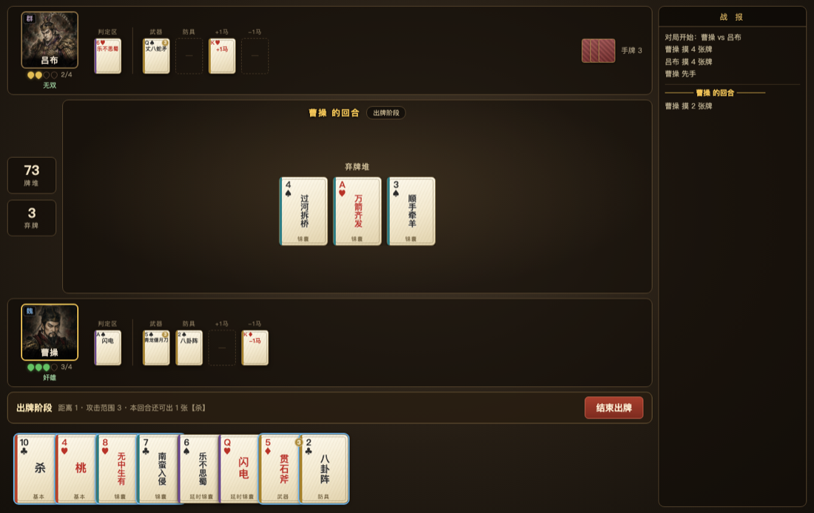
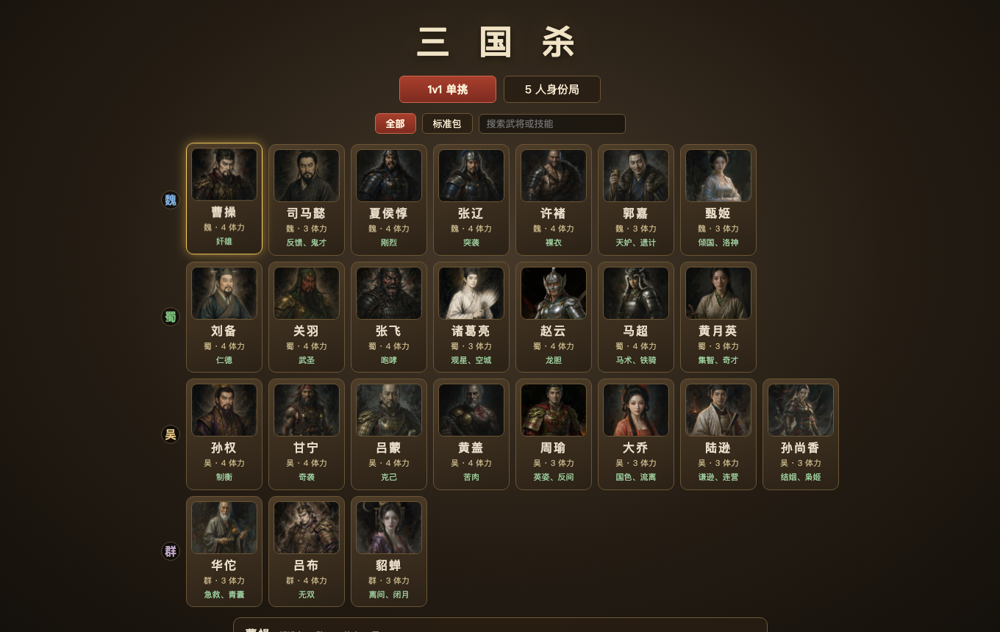

# 三国杀 1v1（标准版复刻）

用原生 JavaScript + Electron 复刻的《三国杀》标准版单挑对局，含完整回合流程、8 名武将技能、108 张官方牌堆（标准版 + EX）与启发式 AI 对手。**零构建步骤、零前端框架、零运行时依赖**。

> ⚠️ 本项目仅供个人学习与技术研究，非商业用途。《三国杀》的武将、卡牌、规则及美术设定等知识产权归**游卡桌游（Yoka Games）**所有，与本项目无关。若官方有异议请联系我删除。

## 截图

对局界面：左侧牌桌（对手区 / 中央处理区 / 自己区 / 操作横幅 / 手牌），右侧战报。



选将界面：



> 武将头像为 AI 生成，非官方美术素材。

## 运行

```bash
npm install
npm start          # Electron 启动对局
```

## 功能

**回合流程**：准备 → 判定 → 摸牌 → 出牌 → 弃牌 → 结束，含濒死求桃、无懈可击响应链（可反复反制）、延时锦囊判定。

**单挑规则**：起始手牌数等于武将体力上限（诸葛亮/司马懿 3 张），先手首回合摸牌阶段少摸一张。

**武将（8 名）**

| 武将 | 势力/体力 | 技能 |
| --- | --- | --- |
| 刘备 | 蜀 4 | 仁德 |
| 关羽 | 蜀 4 | 武圣 |
| 张飞 | 蜀 4 | 咆哮 |
| 诸葛亮 | 蜀 3 | 观星、空城 |
| 曹操 | 魏 4 | 奸雄 |
| 司马懿 | 魏 3 | 反馈、鬼才 |
| 孙权 | 吴 4 | 制衡 |
| 吕布 | 群 4 | 无双 |

**牌堆（108 张）**：官方标准版 104 张 + EX 4 张（寒冰剑、仁王盾、♥Q【闪电】、♦Q【无懈可击】），四种花色各 27 张。

**已实现的规则细节**

- **距离与攻击范围**：距离 = max(1, 1 + 目标 +1 马 − 自己 −1 马)；【杀】受武器攻击范围限制，【顺手牵羊】需距离 1，【决斗】【过河拆桥】不受限
- **转化技**：武圣（红色牌当【杀】，含装备区的牌，按失去该装备后的距离判定）、丈八蛇矛（点武器按钮后选两张手牌当【杀】），出牌与响应双时机均支持
- **武器**：诸葛连弩（无限【杀】）、青釭剑（无视防具）、寒冰剑（防止伤害改为弃对方两张牌）、青龙偃月刀（被闪后可连续追杀）、贯石斧（弃两张牌强制命中，可弃装备）、麒麟弓（造成伤害时弃马）、雌雄双股剑（异性目标）、丈八蛇矛
- **防具**：八卦阵（判定红色视为【闪】）、仁王盾（黑色【杀】无效；丈八合成【杀】两张同色才有颜色）
- **伤害时机**：扣体力 → 濒死求桃 → 存活后才触发奸雄/反馈（反馈拿到的桃不能用于本次自救）
- **反馈**只能获得手牌与装备区的牌（不含判定区）；**桃园结义**跳过满体力角色
- **鬼才**可改**任意角色**的判定，原判定牌置入弃牌堆（不归改判者）
- **奸雄**可获得造成伤害的牌，包括丈八蛇矛合成【杀】的两张实体牌、【南蛮入侵】/【万箭齐发】
- **闪电**判定 ♠2–9 造成 3 点雷电伤害，否则移至下一名角色判定区

## 架构

引擎与界面完全解耦：引擎通过 `Controller` 接口异步向"玩家"提问，人类（`UIController`）与 AI（`AIController`）实现同一接口，因此**同一套引擎既能跑 UI 对局，也能纯逻辑批量自测**。

```
src/
├── controller.js        # Controller 接口：引擎向玩家提问的契约
├── player.js
├── core/                # 引擎（不依赖 DOM）
│   ├── game.js          # 对局状态、钩子系统、座位顺序
│   ├── turn.js          # 回合与阶段流程
│   ├── card-use.js      # 出牌/响应结算、虚拟牌
│   ├── nullify-chain.js # 无懈可击响应链
│   ├── judge.js damage.js dying.js deck.js util.js
├── data/
│   ├── cards.js         # 牌堆数据 + 全部规则判据（单一来源）
│   ├── heroes.js
│   └── skills/          # 需要询问玩家的技能钩子
├── ai/                  # 启发式 AI（纯函数策略）
└── ui/                  # 渲染与事件（唯一接触 DOM 的层）
```

### 设计要点

**规则判据只有一份**。能否使用、目标是否合法、【杀】的次数上限、转化途径等全部集中在 `data/cards.js`（`canUseInPlayPhase` / `canTarget` / `shaLimitOf` / `canUseCardAs`），由引擎在结算入口强制执行，UI 的可点牌判断与 AI 的决策筛选都调用同一函数。

这条约束是踩坑换来的：早期出牌合法性只写在 UI 里、引擎不校验、AI 又写第三份，结果【闪】能被主动使用、【杀】的每回合限制无人强制、任意牌都能冒充【无懈可击】。

**引擎不信任输入**。所有玩家决策都经过校验：牌必须真在手里、牌名必须相符或存在合法转化途径、目标必须合法。非法输入一律拒绝并记日志，而非崩溃或静默生效。

**锁定技用同步判据，钩子只留给需要询问的时机**。咆哮/武圣/无双通过 `hasSkill` 同步判断（这样 UI 的同步渲染也能复用同一规则）；奸雄/反馈/鬼才/观星/空城才注册异步钩子。

## 测试

```bash
npm test           # 73 项单元测试（引擎 + 技能 + 装备 + 官方规则边界）
npm run test:rules # 出牌规则与 UI 交互断言（jsdom）
npm run test:play  # 自动对局：jsdom 加载真实 UI 自动点击打完 16 局
npm run shot       # 截图当前界面，用于人工核对布局
```

`tests/` 下的工具：

| 文件 | 作用 |
| --- | --- |
| `engine.test.js` `skills.test.js` `official-rules.test.js` `ai-regression.test.js` | 确定性单元测试 |
| `ui-rules-check.js` | 在真实 DOM 上逐条验证出牌规则与交互（含"点击不可选牌应无效"） |
| `ui-dom.js` | jsdom 加载真实 `index.html` + `app.js`，自动点击打完整局，带日志异常扫描与技能覆盖统计 |
| `ui-sim.js` | `Controller` 契约层模拟，不依赖 DOM |
| `shot.js` | Playwright 截图（自带静态服务） |

**牌总数守恒**是最有效的不变量：统计牌堆 + 弃牌堆 + 结算区 + 各玩家手牌/判定区/装备区的唯一 id 数是否等于总张数，能同时抓出重复弃置与丢牌。

## 已知取舍

- **观星在 1v1 只看 2 张**：官方公式为 `min(5, 存活角色数)`，2 人局即 2 张
- **方天画戟**仅作为攻击范围 4 的武器：其"最后手牌当【杀】可指定至多 3 个目标"在 1v1 只有单一敌人，无实际意义
- **AI 是启发式规则**，非搜索或学习模型

## License

MIT（仅覆盖本仓库的代码实现；《三国杀》游戏规则与设定的知识产权归游卡桌游所有）
